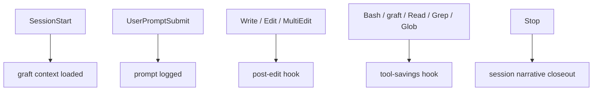

# Working in Atlas

Atlas is a local-first Node.js runtime for headless AI agents.

## Repository rules

- Keep the public repository provider-neutral and free of credentials or personal data.
- Public runtime code belongs under `src/`.
- Private user data (workspace `personal/`, `projects/`) and private technical state (workspace `profiles/`, `sessions/`, `config/`, `control-plane/`, `integrations/`, `archive/`) live at the workspace root, outside the engine, and must remain ignored by Git.
- The engine must not contain private runtime data.
- Use `sessions/sessions.sqlite` only for session metadata, session events, and parent-child links.
- Keep provider execution inside `src/infrastructure/providers/`.
- Do not add `Adapters`, `Handoff`, `Mission`, `Coordinator`, or the legacy Python/Bash runtime.
- Do not add hosted services, PostgreSQL, Redis, or dashboards to the local runtime.

## Development

```bash
pnpm install
pnpm build
pnpm test
```

Never store credentials in source, configuration, logs, tests, or documentation.

## Agent workflow (`.claude`)

`.claude/settings.json` wires four hook points to `.claude/helpers/graft-hooks.cjs`:

- `SessionStart` — loads `graft` context for the session.
- `UserPromptSubmit` — records the prompt for the session's brain-dump.
- `PostToolUse` on `Write|Edit|MultiEdit` — runs `post-edit` bookkeeping.
- `PostToolUse` on `Bash|mcp__graft__|Read|Grep|Glob` — records `tool-savings` from using
  `graft` instead of raw search.
- `Stop` — closes out the session narrative.

`.claude/skills/graft/SKILL.md` is the required first stop for any code question in this
repo: query the `graft/` graph before grepping or reading source files directly.



## Plan, then execute

`skills/core/` defines the cycle every task should follow:

1. `catch-up` — reconstruct project state, completed work, blockers, and the next action
   before touching anything.
2. `core-thinking` — separate facts from assumptions, choose the smallest valid solution.
3. Execute the change.
4. `verification` — turn the implementation claim into a repeatable, independently
   checkable test.
5. `session-handoff` — leave a compact continuation packet for whoever picks this up next.

A completed session can itself become a new skill: `atlas skill learn <session-id>`
extracts a candidate, and `atlas skill review <candidate-id> promoted` reviews and
activates it. See [skills/index.json](skills/index.json) for what's currently live.
