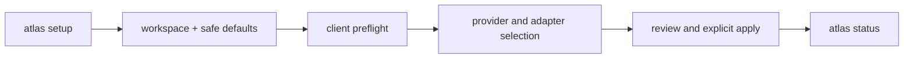
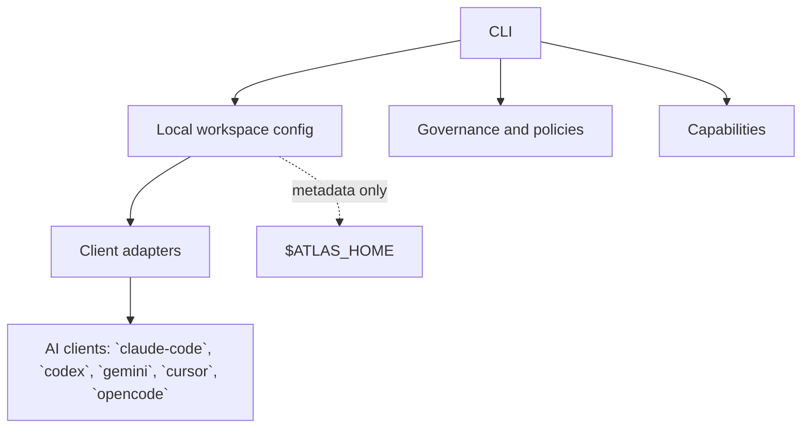

# Atlas


Atlas is a local-first operating layer for AI coding agents. It helps one workspace
connect safely to multiple clients while keeping private data under `$ATLAS_HOME`.

## Start here

```bash
export PATH="$PWD/cli:$PATH"
atlas setup
atlas status
```

`atlas setup` is the guided terminal interface. It discovers clients, lets you choose
providers and adapters, shows the plan, and requires explicit approval before applying.

The generated section below is the maintained local reference. It is rebuilt from
`devkit/docs/atlas-catalog.json`, so the README stays aligned with the shipped CLI.

<!-- atlas:readme-generated:begin -->
## Atlas — local reference

Atlas is a local-first operating layer for AI coding agents. Reusable code lives in
this repository; private workspace data lives under `$ATLAS_HOME` and is never generated
into this README.

### Features

| Feature | What it provides |
|---|---|
| Setup | Guided first-run setup |
| Onboarding | Workspace onboarding |
| Integrations | Client adapters and connections |
| Agentic Runs | Bounded agentic execution |
| Migration | Safe layout migration |
| Rollback | Recoverable rollback paths |
| Release Gates | Deterministic release checks |

### Quick start

```bash
export PATH="$PWD/cli:$PATH"
atlas setup
atlas status
```

### Setup flow



### Architecture



### Supported clients

| Client | Role |
|---|---|
| `claude-code` | Adapter declared in the local registry |
| `codex` | Adapter declared in the local registry |
| `gemini` | Adapter declared in the local registry |
| `cursor` | Adapter declared in the local registry |
| `opencode` | Adapter declared in the local registry |

### Main commands

- `atlas init`
- `atlas setup`
- `atlas setup reconfigure`
- `atlas providers status|add|remove`
- `atlas structure plan|apply|check`
- `atlas onboard`
- `atlas integration inventory|detect|register|list`
- `atlas activity`
- `atlas agentic`
- `atlas migrate`
- `atlas update`
- `atlas docs`

### Local documentation

- [Getting started](devkit/docs/use/getting-started.md)
- [Adapters](devkit/docs/use/adapters.md)
- [Workspace](devkit/docs/use/workspace.md)
- [Architecture decisions](devkit/docs/design/decisions.md)
- [GitDiagram view](https://gitdiagram.com)
<!-- atlas:readme-generated:end -->

## Safety model

- Reusable code belongs in this repository.
- Private memory, projects, knowledge, and runtime state belong under `$ATLAS_HOME`.
- Client homes remain client-owned; Atlas stores metadata and bridge configuration only.
- Setup never stores credentials and never silently approves or sends work.

## Read next

- [Getting started](devkit/docs/use/getting-started.md)
- [Workspace layout](devkit/docs/use/workspace.md)
- [Adapters](devkit/docs/use/adapters.md)
- [Capabilities](devkit/docs/use/capabilities.md)
- [Architecture decisions](devkit/docs/design/decisions.md)
- [Documentation index](devkit/docs/README.md)

## Development

```bash
atlas docs check
python3 devkit/tests/test-release-gate.py
```

The project is local-first by design: generated docs, configuration metadata, and
verification run from the checked-out Atlas repository without a runtime service.
