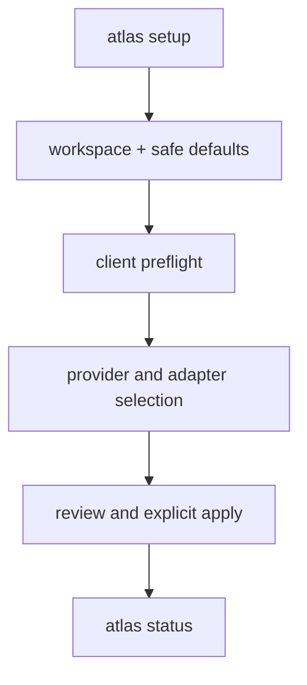
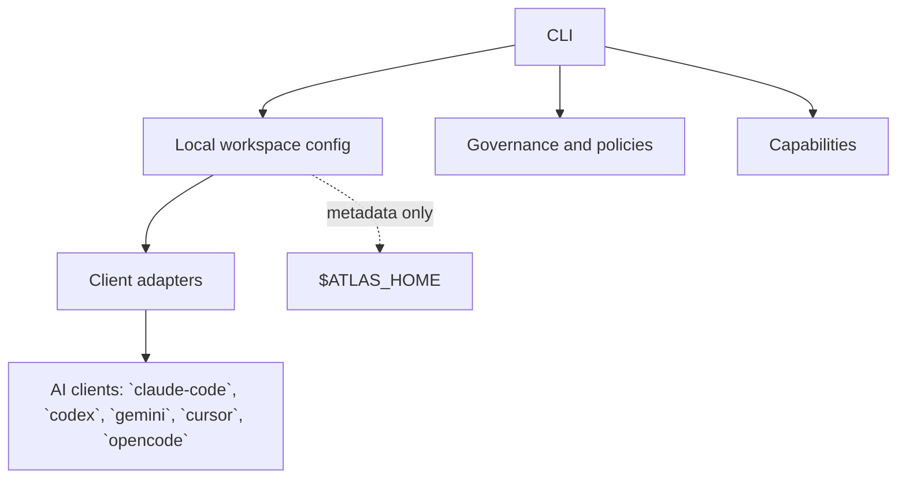
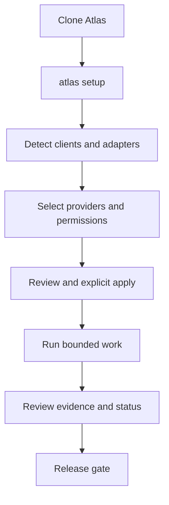

# Atlas


Atlas is a local-first operating layer for AI coding agents. It helps one workspace
connect safely to multiple clients, keep memory and projects organized, enforce scope,
and verify what happened while keeping private data under `$ATLAS_HOME`.

## Start here

```bash
git clone <repository-url> atlas
cd atlas/engine
export PATH="$PWD/cli:$PATH"
atlas setup
atlas status
```

`atlas setup` is the guided terminal interface. It discovers clients, lets you choose
providers and adapters, shows the plan, and requires explicit approval before applying.
Atlas is useful when multiple AI clients share one workspace and you need predictable
configuration, safe write boundaries, and evidence instead of guesswork.

The generated section below is the maintained local reference. It is rebuilt from
`devkit/docs/atlas-catalog.json`, so the README stays aligned with the shipped CLI.

<!-- atlas:readme-generated:begin -->
## What Atlas is

Atlas is a local control layer for AI coding agents. It gives one workspace a clear,
safe way to connect clients, keep project memory organized, apply governance, and prove
what happened. It does not replace the AI client or store credentials.

## Why it is useful

| Problem | Atlas benefit |
|---|---|
| Every client has different setup rules | One client-neutral registry and setup flow |
| Work and memory become scattered | One private `$ATLAS_HOME` workspace |
| Agents can write outside the intended scope | Admission, leases, claims, and explicit approval |
| Setup state becomes unclear | Deterministic status, preflight, and release checks |
| Documentation drifts from the code | Local catalog-driven generation and stale checks |

### Features

| Feature | What it provides |
|---|---|
| Setup | Guided first-run setup |
| Onboarding | Workspace onboarding |
| Integrations | Client adapters and connections |
| Agentic Runs | Bounded agentic execution |
| Migration | Safe layout migration |
| Rollback | Recoverable rollback paths |
| Release Gates | Deterministic release checks |

### Quick start

```bash
git clone <repository-url> atlas
cd atlas/engine
export PATH="$PWD/cli:$PATH"
atlas setup
atlas status
```

Requirements: `bash`, `git`, and `python3`. No package manager or hosted service is
required for the core workflow.

### Setup flow



### Architecture



### How the parts relate

| Part | Answers | Owns |
|---|---|---|
| CLI/Core | How does Atlas resolve and enforce work? | Shared mechanisms and contracts |
| Adapter | How does one AI client reach Atlas? | Client-specific integration |
| Capability | What can Atlas do? | One client-neutral operation surface |
| Domain | What area of work is this? | A declaration, never execution |
| Governance | What must be true? | Policies, permissions, and safety rules |
| Workspace | Where is user-owned state? | Memory, projects, knowledge, and runtime records |

### Typical workflow



### Safety states

Atlas keeps availability, permission, execution, and verification separate. A tool being
installed does not mean it is allowed; a command running does not mean its result is
verified. Write operations use explicit identity, scope, lease, claim, and admission
evidence, and stale or conflicting state fails closed.

### Repository layout

```text
engine/
├── cli/                 Atlas commands and entrypoint
├── extensions/          client-neutral capabilities and skills
├── agentic/              adapter and integration manifests
├── governance/          reusable policies and safety contracts
├── devkit/docs/          generated docs and usage guides
└── devkit/tests/         isolated contract and release tests
```

Private user state stays outside the public repository under `$ATLAS_HOME`.

### Supported clients

| Client | Role |
|---|---|
| `claude-code` | Adapter declared in the local registry |
| `codex` | Adapter declared in the local registry |
| `gemini` | Adapter declared in the local registry |
| `cursor` | Adapter declared in the local registry |
| `opencode` | Adapter declared in the local registry |

### Main commands

- `atlas init`
- `atlas setup`
- `atlas setup reconfigure`
- `atlas providers status|add|remove`
- `atlas structure plan|apply|check`
- `atlas onboard`
- `atlas integration inventory|detect|register|list`
- `atlas activity`
- `atlas agentic`
- `atlas migrate`
- `atlas update`
- `atlas docs`

### Local documentation

- [Getting started](devkit/docs/use/getting-started.md)
- [Adapters](devkit/docs/use/adapters.md)
- [Workspace](devkit/docs/use/workspace.md)
- [Architecture decisions](devkit/docs/design/decisions.md)
- [GitDiagram view](https://gitdiagram.com)

### Current boundaries

Atlas is not a hosted service, credential manager, autonomous approval system, or
replacement for an AI model provider. It coordinates local tools and records evidence;
the owner remains responsible for approvals, credentials, and publishing changes.
<!-- atlas:readme-generated:end -->

## Safety model

- Reusable code belongs in this repository.
- Private memory, projects, knowledge, and runtime state belong under `$ATLAS_HOME`.
- Client homes remain client-owned; Atlas stores metadata and bridge configuration only.
- Setup never stores credentials and never silently approves or sends work.

## Read next

- [Getting started](devkit/docs/use/getting-started.md)
- [Workspace layout](devkit/docs/use/workspace.md)
- [Adapters](devkit/docs/use/adapters.md)
- [Capabilities](devkit/docs/use/capabilities.md)
- [Architecture decisions](devkit/docs/design/decisions.md)
- [Documentation index](devkit/docs/README.md)

## Development

```bash
atlas docs check
python3 devkit/tests/test-release-gate.py
```

The project is local-first by design: generated docs, configuration metadata, and
verification run from the checked-out Atlas repository without a runtime service.
