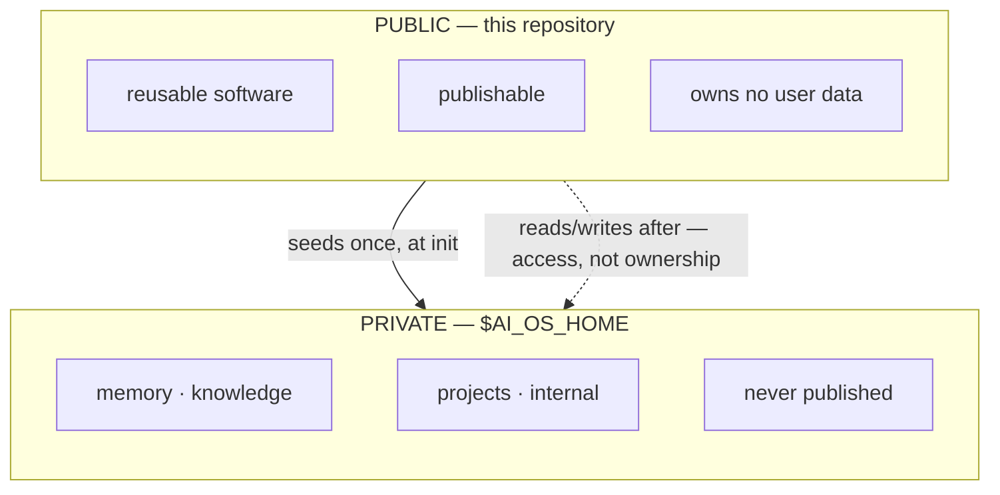
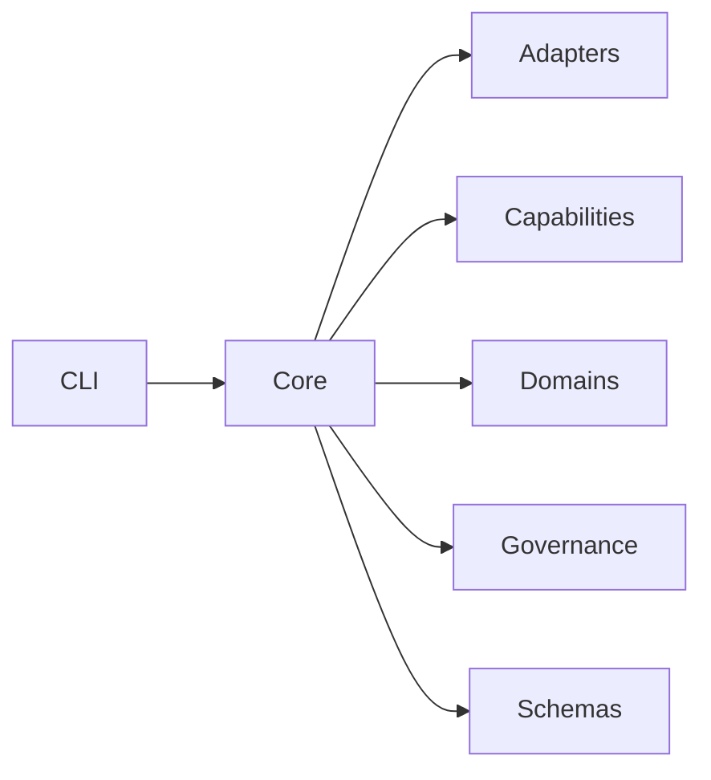

# AI OS

A portable operating layer for AI coding agents — not a Claude Code configuration.

AI OS separates the parts of an AI development setup that are genuinely reusable (memory
schema, knowledge taxonomy, skills, policies, a CLI) from the parts that are specific to
one person (their actual memory, their actual projects) and one client (how Claude Code,
specifically, enforces a policy). The reusable half is this repository. The personal half
never leaves your machine.

## Two layers, two owners

| | Lives | Owns |
|---|---|---|
| **Public** (this repo) | wherever you clone it | code, CLI, adapters, capabilities, domain declarations, policies, schemas, public skills, templates, docs, tests |
| **Private** (your workspace) | `$AI_OS_HOME`, default `~/.ai-os` | your memory, projects, knowledge, daily records, and `internal/` for system config, session records and transient generated state |

**Access is not ownership.** The CLI reads and writes your workspace constantly — that is
its job. It does not follow that this repository owns, tracks, or may publish any of it.
This repository writes *into* your workspace from its templates, once, at `ai-os init`,
and never reads back.



Full contract, including the four invariants `ai-os doctor` checks:
**[docs/design/public-private.md](docs/design/public-private.md)**.

## Install

```bash
git clone <this-repo> ~/ai-os
export PATH="$HOME/ai-os/cli:$PATH"
ai-os init --dry-run     # see exactly what would happen
ai-os init               # create ~/.ai-os — never overwrites anything
ai-os doctor             # verify the contract holds
```

Requires `bash`, `git`, `python3`. Nothing else — no package manager, no dependencies, no
build step. Guided path: **[docs/use/getting-started.md](docs/use/getting-started.md)**.
Full walkthrough: **[docs/use/install.md](docs/use/install.md)**.

## Status

`VERSION` is the only version claim worth trusting here — commit messages and code
comments have applied milestone numbers inconsistently, so this section describes what is
*on disk*.

What ships:

- The public/private split, checked by `ai-os doctor` on every run.
- One CLI entry point with fourteen verbs, `init` ownership-aware and non-destructive, and
  `privacy-scan` checking that this repository is still publishable.
- Five adapters — Claude Code, Codex, Cursor, Gemini, OpenCode.
- One capability: browser control, in `capabilities/browser/`.
- Two domain declarations, in `domains/`.

It deliberately does **not** yet include an autonomous task engine, a multi-agent system,
a full model router, computer automation beyond the browser, AI-OS-managed MCP servers, or
a GUI. A **domain** is a declaration and nothing more — nothing here executes one; naming
an area of work is the entire feature. Why it stays this size on purpose:
**[docs/design/decisions.md](docs/design/decisions.md)**.

## How it fits together



Core is the mechanism shared across every client and every capability —
`capability · availability · authority · invocation · result · verification ·
persistence`, and nothing else. An **adapter** answers *how does one AI client reach AI
OS?* A **capability** answers *what can AI OS do?* A **domain** answers *what area of
work is this?*, and executes nothing. **Governance** is policy: what must be true,
client-agnostically — it lives in `governance/policies/` today. **Schemas** are the contracts
everything above is checked against. Detail on each: `docs/design/core.md`,
`docs/use/adapters.md`, `docs/use/capabilities.md`, `docs/use/domains.md`,
`docs/design/governance.md`.

## Layout

```
ai-os/                      the public repository — software only
├── cli/                    ai-os, one entry point: init · onboard · doctor · status ·
│                           workspace · adapter · capability · domain · run · render ·
│                           memory · privacy-scan — plus the hook launcher and ai-sync
├── core/                   pointer to docs/design/core.md — no separate binary yet
├── adapters/<client>/      client integrations — manifest, hooks, policy enforcement
├── capabilities/<id>/      what AI OS can do — browser control ships today
├── domains/                areas of work, declared and inert — nothing executes one
├── schemas/                the contracts: adapter · capability · domain · run
├── governance/             policy: the contract, privacy classification, git approval
├── skills/                 public skills — yours in ~/.ai-os/skills override these
├── templates/
│   ├── workspace/          seeds for a new ~/.ai-os — placeholder data only
│   └── runtime/            operational scripts, kept public and never seeded
├── examples/
├── docs/
├── tests/
└── internal/               tooling-only — not part of the product surface
```

Agent definitions are not here: they live in your workspace, because an agent is
configuration you own rather than software this repository ships.

> **Adapter vs capability vs domain.** An **adapter** answers *"how does this AI client
> reach AI OS?"* (`adapters/<client>/adapter.yaml`). A **capability** answers *"what can
> AI OS do?"* (`capabilities/<id>/capability.yaml`). A **domain** answers *"what area of
> work is this, and which capabilities would delivering it need?"* (`domains/<id>.yaml`)
> — and stops there: no command, no verifier, no ordering.

> **Renamed 2026-09-03.** The capability surface was spelled `plugin` until then. Every
> old spelling still works for one version and is compatibility only: `plugins/`,
> `plugin.yaml`, `ai-os plugin`, `AI_OS_PLUGINS`. The manifest key stays `plugin:` under
> contract 1, so no existing manifest needs editing. Details:
> [docs/use/capabilities.md](docs/use/capabilities.md).

## Where to read next

**[docs/README.md](docs/README.md)** is the full reading order — `use/` for how to do
something, `design/` for why it works this way.

## Tests

```bash
tests/test-contract.sh   # the contract suite, in a throwaway workspace
```

Not yet ready for general use — this assumes a single-user local setup and has only been
exercised against one machine. Treat it as a working sketch, not a released tool.
