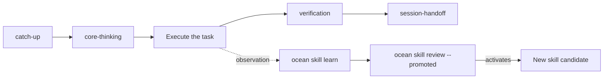

# Ocean

Ocean is a **local-first operating layer for AI agents** (an "AI OS") — a runtime for
running Claude, Codex, Gemini, Antigravity, and Hermes as headless agents inside one
workspace. It manages profiles, bounded context,
sessions, artifacts, and local hooks without a hosted service.

## Quick start

Install the published package when available:

```bash
npm install --global ocean
ocean setup
```

After installation, `ocean` opens a short first-run wizard automatically when the private
workspace does not exist. Use `ocean --yes` for the recommended non-interactive defaults.

For a local checkout, use the development commands below instead.

```bash
git clone https://github.com/amoree-code/ocean.git ocean
cd ocean
pnpm install
pnpm build
node packages/core/dist/main.js setup
```

Connect an Obsidian vault during setup, or connect it later:

```bash
ocean setup --obsidian /path/to/Obsidian
ocean obsidian connect /path/to/Obsidian
ocean obsidian discover
ocean obsidian sync
```

The connection is read-only by default. Use `--read-write` only when Ocean is explicitly
allowed to write notes. The local runtime watches the connected vault while `ocean service`
is running.

Expose the same vault tools to an AI client through a provider-neutral stdio MCP server:

```bash
ocean mcp config
ocean obsidian mcp
```

`ocean mcp config` prints the client configuration; it does not write into client-owned
configuration files or store credentials.

The Ocean MCP server exposes read-only workspace tools, resources, and review prompts.
Local `stdio` clients provide the connection consent; Ocean keeps write and execution
approval inside its policy boundary.

By default, `setup` creates the Ocean workspace as a private sibling directory next to
this repository (e.g. `ocean/` next to `ocean/kernel/`), not inside it, and installs
user-level startup integration pointed at this repository's `packages/core/dist/main.js`.
Later logins
start the local runtime automatically. Set `ATLAS_ROOT` to use a different workspace
location instead.

Run an agent:

```bash
node packages/core/dist/main.js run --profile default --prompt "Review this project"
```

Open a provider through Ocean's managed PTY boundary when interactive use is
required:

```bash
ocean client open hermes
ocean client open claude
ocean client status
```

`ocean run` is the full-head path. Direct provider commands remain transparent
terminal-shim compatibility paths with an explicitly recorded `observed`
control level. See [entry-point contract](docs/entry-points.md).

Inspect or resume a saved session:

```bash
node packages/core/dist/main.js session list
node packages/core/dist/main.js session show <session-id>
node packages/core/dist/main.js session resume <session-id> "Continue the review"
node packages/core/dist/main.js session promote <session-id> knowledge/results --approve
```

Promotion is explicit: it copies a bounded, redacted provider result into private Ocean
knowledge and records the source session. It never promotes a session implicitly.

Continue the same task from any registered client with a compact Ocean-owned handoff:

```bash
ocean handoff create --task T-193 --next "Run verification"
ocean handoff context <handoff-id>
ocean run --profile reviewer --client codex --task T-193 --handoff <handoff-id> --prompt "Continue"
ocean idea save "Short title" "Raw idea text"
ocean daily start
```

Capture an idea without a provider subscription:

```bash
ocean capture add "An idea to review later"
ocean capture list
ocean capture promote <id> knowledge/results

# Learn a skill candidate from a completed session; review it before activation
ocean skill learn <completed-session-id>
ocean skill review <candidate-id> promoted

# Workspace health (read-only)
ocean doctor
ocean doctor --json

# Safe repair preview; apply only after reviewing the output
ocean repair
ocean repair --apply
```

The installed provider must be available on `PATH`. Ocean does not store provider
credentials.

## Repository layout

```text
ocean/                      private workspace root (local-only repo, no remote)
├── kernel/                 THIS repository — public Ocean Runtime (pnpm workspace root)
│   ├── packages/
│   │   └── core/           the `ocean` package
│   │       ├── src/        domain / application / infrastructure / interfaces
│   │       ├── templates/
│   │       ├── tests/
│   │       └── package.json
│   ├── scripts/
│   └── bridge/             machine-local state — git-ignored, never published
│                           profiles, sessions, config, control-plane, integrations
├── brain/                  private user, project and knowledge records
└── sessions/               narrative session records
```

Only `kernel/` is this repository. `brain/` and `sessions/` are siblings in the private
workspace and are not part of it. `bridge/` sits physically inside this repo but is
git-ignored in full and is never part of a public commit.

The workspace root resolves to the parent directory by default; set `OCEAN_ROOT` (or the
older `ATLAS_ROOT`) to choose another. Startup entries execute the engine from
`kernel/packages/core/dist/main.js` while using the private workspace as their working
directory.

## Development

```bash
pnpm install
pnpm build
pnpm test
```

The test suite uses local processes and temporary SQLite databases. It does not
invoke a real provider or require an API key.

Build and run the isolated test image:

```bash
docker build -t ocean-test .
docker run --rm ocean-test
```

The image validates the Ocean engine and test suite. Provider CLIs and their credentials
remain on the host and are not included in the image.

## Agent skills

Ocean ships a small set of provider-neutral Agent Skills under `packages/core/skills/core/`,
invoked
by name from any registered client:

- `catch-up` — reconstruct project state, completed work, blockers, and the next action.
- `core-thinking` — separate facts from assumptions and choose the smallest valid
  solution before executing.
- `verification` — turn an implementation claim into a focused, repeatable check.
- `session-handoff` — produce a compact continuation packet for the next session.
- `graft` — query the repo graph for locating code, tracing callers, and scoping edits
  instead of grepping or reading source files directly.

Skills are not hand-authored from scratch: `ocean skill learn <completed-session-id>`
extracts a candidate from a finished session, and `ocean skill review <candidate-id>
promoted` reviews and activates it. See [skills/index.json](skills/index.json) for the
current catalog.


```mermaid
flowchart LR
    A[catch-up] --> B[core-thinking]
    B --> C[Execute the task]
    C --> D[verification]
    D --> E[session-handoff]
    C -.observation.-> F["ocean skill learn"]
    F --> G["ocean skill review --promoted"]
    G -->|activates| H[New skill candidate]
```

## Documentation

- [Architecture](docs/architecture.md) — layers, execution flow, and the public/private boundary
- [Workspace](docs/workspace.md) — layout, path resolution, and `ocean setup`
- [Profiles](docs/profiles.md) — schema, loading, and the default profile
- [Sessions](docs/sessions.md) — storage, status lifecycle, and CLI usage
- [Providers](docs/providers.md) — supported providers and how they are invoked
- [Context](docs/context.md) — how the prompt context is assembled and bounded
- [Security](docs/security.md) — credentials, the workspace boundary, and access control
- [Troubleshooting](docs/troubleshooting.md) — common errors and how to resolve them
- [Migration](docs/migration.md) — what changes between versions and how to move a workspace
- [Changelog](packages/core/CHANGELOG.md) — versioned release notes

## License

Ocean is open source. See [LICENSE](LICENSE).
