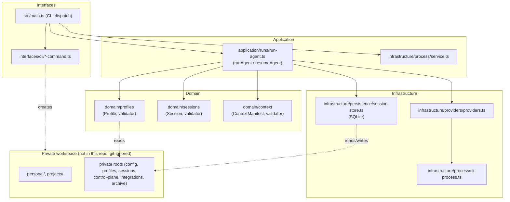

# Architecture

See [operating-model.md](operating-model.md) for the canonical ownership, request-flow,
provenance, credential, CLI/MCP, and provider-boundary contract.

Atlas is a local-first operating layer for AI agents (an "AI OS"), implemented as a Node.js
runtime for running headless AI agent CLIs (Claude, Codex, Gemini, Antigravity, Hermes)
inside one workspace. The engine repository is public and
provider-neutral; all user data and technical state live in a private workspace next to it.

Capabilities declare the operation, authority, idempotency, and independent verification
contract. Infrastructure implements the mechanics; a provider response never substitutes for
the post-condition check. The reference `workspace.read` capability enforces the profile path
boundary and returns a content hash.

## Adding a capability

1. Propose one narrow operation with its authority, idempotency, and verification contract.
2. Implement provider mechanics under `src/infrastructure/` without adding business rules.
3. Enforce profile/session allowlists and explicit approval for writes.
4. Add denied, timeout, and post-condition tests before exposing the operation through MCP.
5. Record evidence from the independent verification result, not from the provider response.

## Layers

- **Interfaces** — `src/main.ts` performs top-level dispatch, while focused handlers and the
  canonical help catalog live under `src/interfaces/cli/`. Run `atlas --help` for the complete
  current command surface.
- **Application** — `src/application/runs/run-agent.ts` (`runAgent` / `resumeAgent`, the orchestration
  entry points) and `src/infrastructure/process/service.ts` (long-running process for startup integration).
- **Domain** — `src/domain/profiles/`, `src/domain/sessions/`, `src/domain/context/`:
  the `Profile`, `Session`, and `ContextManifest` types and their Zod validators.
- **Infrastructure** — `src/infrastructure/providers/providers.ts` (builds provider CLI invocations),
  `src/infrastructure/process/cli-process.ts` (spawns and streams a child process), and
  `src/infrastructure/persistence/session-store.ts` (SQLite persistence via `node:sqlite`).

## Public engine / private workspace boundary

This repository (`engine/`) contains only source, tests, templates, and build output — no
user data. Everything Atlas reads or writes at run time lives in a separate **workspace**
root (see [workspace.md](workspace.md)). The two are joined only through paths resolved at
startup (`src/paths.ts`) and are never mixed into the same directory tree or the same git
history.

## Execution flow (`atlas run`)

1. `main.ts` parses the command and calls `runAgent`.
2. `runAgent` loads the named profile (`profile-loader.ts`), opens the session store, and
   creates a `Session` row with status `created`.
3. `buildContext` reads the profile's `contextSources`, filtered by `allowedPaths`, into a
   bounded prompt prefix.
4. `runProvider` builds the provider's CLI invocation and `runHeadless` spawns it, streaming
   stdout as JSON/text events back into the session's event log.
5. The session status transitions to `running`, then `completed`/`failed` based on exit code.

See [providers.md](providers.md), [profiles.md](profiles.md), [sessions.md](sessions.md),
and [context.md](context.md) for detail on each stage.
