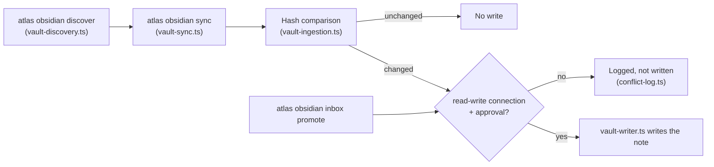

# Atlas MCP connection

Atlas exposes the governed Obsidian tools through one provider-neutral stdio MCP server. Generate the native client configuration with:

```sh
atlas mcp config
```

Copy the returned `mcpServers` object into the MCP configuration of each approved AI client. The same generated entry works for Claude, Codex, Gemini, Hermes, and other clients that support stdio MCP; only the client-owned configuration location differs.

The server also exposes bounded read-only continuity surfaces: `atlas_task_get`,
`atlas_handoffs_list`, `atlas_handoff_get`, `atlas_session_get`, and `atlas_session_events`,
plus `atlas://handoffs`. Every client receives the same Atlas-owned metadata; provider-native
transcripts and credentials are not copied between clients.

The server reads the private connection at `ATLAS_ROOT/system/integrations/obsidian/connection.json`. It never receives provider credentials. Keep the connection `read-only` until the client route is verified. Mutating tools require both client approval and an explicit `read-write` connection.

## Obsidian sync flow

`atlas obsidian discover` and `atlas obsidian sync` run read-only by default; a write only
happens when the connection is explicitly `read-write` and the caller (client or MCP tool)
approves it.


