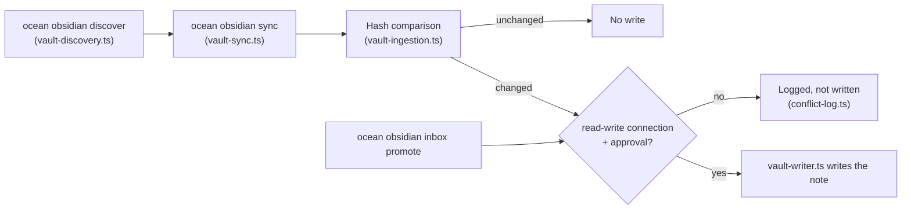

# Ocean MCP connection

Ocean exposes the governed Obsidian tools through one provider-neutral stdio MCP server. Generate the native client configuration with:

```sh
ocean mcp config
```

Copy the returned `mcpServers` object into the MCP configuration of each approved AI client. The same generated entry works for Claude, Codex, Gemini, Hermes, and other clients that support stdio MCP; only the client-owned configuration location differs.

The server also exposes bounded read-only continuity surfaces: `ocean_task_get`,
`ocean_handoffs_list`, `ocean_handoff_get`, `ocean_session_get`, and `ocean_session_events`,
plus the `ocean://handoffs` resource (`ocean://status`, `ocean://profiles` and `ocean://tasks` are
also listed).
The server identifies itself as `ocean` in `initialize` `serverInfo`. Tool and prompt names are `ocean_*`. The generated config entry is keyed `ocean` (`mcpServers.ocean`) — that key is the client-owned identity of an installed entry, so re-running setup never adds a second server. A client still holding an entry under the legacy key from an older release should remove it. Every client receives the same Ocean-owned metadata; provider-native
transcripts and credentials are not copied between clients.

The server reads the private connection at `OCEAN_ROOT/bridge/integrations/obsidian/connection.json`. It never receives provider credentials. Keep the connection `read-only` until the client route is verified. Mutating tools require both client approval and an explicit `read-write` connection.

## Obsidian sync flow

`ocean obsidian discover` and `ocean obsidian sync` run read-only by default; a write only
happens when the connection is explicitly `read-write` and the caller (client or MCP tool)
approves it.


```mermaid
flowchart LR
    Discover["ocean obsidian discover\n(vault-discovery.ts)"] --> Sync["ocean obsidian sync\n(vault-sync.ts)"]
    Sync --> Hash["Hash comparison\n(vault-ingestion.ts)"]
    Hash -->|unchanged| Done[No write]
    Hash -->|changed| Gate{"read-write connection\n+ approval?"}
    Gate -->|no| Conflict["Logged, not written\n(conflict-log.ts)"]
    Gate -->|yes| Write["vault-writer.ts writes the note"]
    Inbox["ocean obsidian inbox promote"] --> Gate
```
